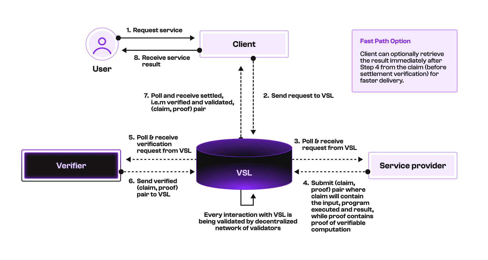

# VSL for AI clients and service providers

## Introduction

Verifiable Settlement Layer (VSL) is an infrastructure-level decentralized network that offers 
scalable, affordable, and customizable verifiability to all web3 protocols, applications, and users. 
It encodes payments, transactions, computations, assets, and data as VSL claims — the fundamental building 
blocks of anything verifiable or provable across platforms, ecosystems, and blockchains.

To understand what customizable verifiability means, specifically in the case of AI clients and service providers,
consider the following example:

A client wants to host a platform where any user can pick and choose an AI service provider to do a certain task.
Once the request has been made by the user, the client will send it to the AI service provider, which will then
process the request and return the result. The client can then forward the result to the user, and that is the end
of the interaction. 

However, how can the client be sure that the AI service provider has actually processed the request
and returned the correct result? This further complicates the situation if this platform and the corresponding AI service
providers are deployed on different Web3 ecosystems, which many AI clients such as [Virtuals](https://whitepaper.virtuals.io/)
and [Sentient](https://www.sentient.xyz/) do. Requests and payments can be recorded on the respective blockchains but
the client has no way of verifying the correctness of the result returned by the AI service provider as the computation
and verification of the result are done off-chain. 

This is where VSL comes in. VSL allows the client to
verify that the AI service provider returned the correct result. It does this by generating a claim that includes the
inputs, the program or model used, the output, and a proof that the request was processed as expected.
This proof can be of various types, such as
[Trusted Execution Environment (TEE)](https://en.wikipedia.org/wiki/Trusted_execution_environment) attestation, 
[Know Your Client (KYC)](https://en.wikipedia.org/wiki/Know_your_customer) verification, or any other verifiable computation method.

VSL achieves this through a decentralized network with the following components:
- Allow AI clients to record requests and payments to the AI service providers.
- Allow AI clients and/or service providers to generate claim-proof pairs based on the result received from the AI service providers and send them to the VSL network, where dedicated verifiers that the AI clients have assigned to verify these claim-proof pairs.
- Allow settled claim-proof pairs, i.e., verified by the dedicated verifiers and validated by the VSL network, to be recorded on the VSL network.

The following diagram illustrates the example flow of the VSL for AI clients, service providers and verifiers:

Things to note in the diagram:

- **Dotted arrows:** Interactions with the VSL can either be done directly or via blockchain mirroring (i.e., transactions 
done in blockchains can be mirrored so that appropriate requests can be sent to VSL).

- **Verifier:** The AI client can assign one or more dedicated verifiers to verify the targeted claim-proof pairs. Each claim-proof
pair would be considered as verified only if a quorum of verifiers has verified it. The VSL network will then validate
the verified claim-proof pairs and settle them for good.

- **Independent parties:** The Client, Service Provider and Verifier are independent of each other as they interact with the VSL 
network to perform their respective tasks, such as sending requests, submitting and settling claim-proof pairs. This means 
that these different parties can be deployed on different Web3 ecosystems, and they can still interact with the VSL network
to perform their tasks without any dependency on each other. This is a key feature of VSL that allows it to provide verifiability
across different Web3 ecosystems and protocols.

- **VSL payments:** Each interaction with the VSL network (represented by arrows entering or exiting the VSL box) incurs fees in terms 
of VSL tokens. These fees consist of a validator fee and/or verifier fee. Such payments can be made using VSL's very own native payment 
system, which is designed to be fast, parallelizable, and cost-effective. Unlike many blockchains where transactions are sequential and 
can be expensive, VSL's payment system generalizes the concept brought up by [FastPay](https://dl.acm.org/doi/abs/10.1145/3419614.3423249),
allowing multiple transactions to be processed in parallel, thus significantly reducing the time taken and cost of payments.

Essentially, VSL just does one thing that we call verifiable settlement: accepting claims, verifying them against their proofs, and settling 
them for good, with fast, cheap, public, and permissionless access across different blockchains. This kind of verifiable infrastructure is currently 
missing in Web3 ecosystems, and we’re building it to provide verifiability to all Web3 protocols, applications, and users. Thus, the
benefits of VSL for AI clients and service providers include the following:

1. **Fast payments and parallel settlements**
2. **Cross-chain protocol support**
3. **Verifiable AI (VAI) infrastructure**

For more details on how VSL can benefit AI clients and service providers, please refer to our [AI one-pager](docs/Pi_Squared_AI_One_Pager.pdf).

## Structure of the Repository

In this repository, we will provide an [demo example](example/) that would guide developers on how to properly set up their implementations of 
clients and service providers to use VSL for verifiable settlement of AI clients and service providers.
We will be using the TEE attestation as an example of a verifiable computation method to generate claims and proofs for 
AI clients and service providers. One can modify the code to use other verifiable computation methods such as KYC verification,
or any other method that can generate claims and proofs that can be verified by the VSL network.

The structure of the repository is as follows:

- [`base-tee`](base-tee/): Contains the base code and data structure types for the claim and proof of TEE attestation.
- [`docs`](docs/): Contains documentation and references related to TEE attestation and/or relevant materials.
- [`example`](example/): Contains an example that demonstrates sample implementations of client, attester (i.e., service provider), verifier, and
their interaction with VSL. This would be the main directory for developers to refer to as it contains instructions on how to set up the demo and 
run it.
- [`generation`](generation/): Contains the code to generate claim and proof for TEE attestation.
- [`verification`](verification/): Contains the code to verify claim and proof for TEE attestation.
- [`tests`](tests/): Contains unit test/s for the claim generation and verification.

More details and/or instructions are provided in the respective directories. 
