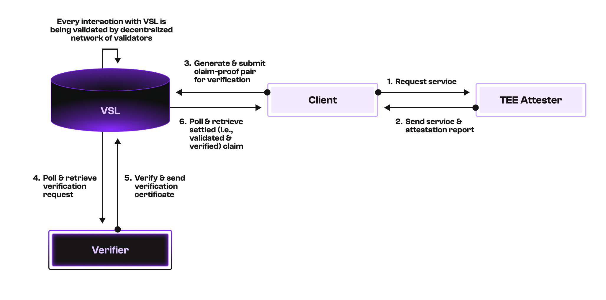
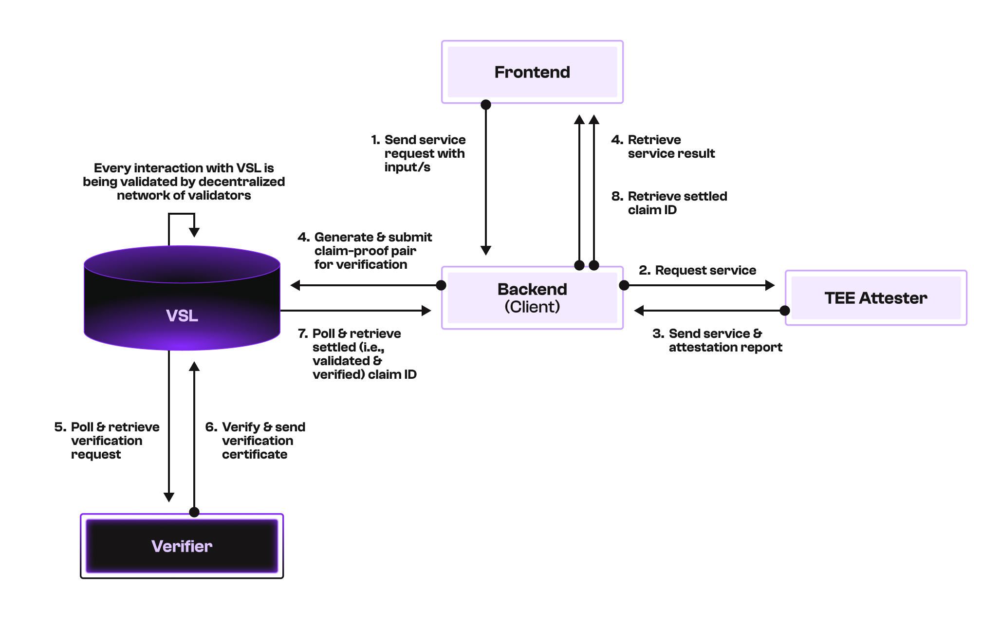

# AI for Trusted Execution Environments (TEE) Demo

This demo showcases how the Verifiable Settlement Layer (VSL) can provide verification of TEE attestation between 
a client and service provider.

We will be providing two sets of instructions to reproduce the demo: one that only contains CLI commands and the other which contains the full setup of the demo with a frontend and backend.

This demo is a simplified version of the one described in our main [README](../README.md) file, where interactions with VSL will only be done via the client and verifier. The service provider (in this case, the attester) will not be directly interacting with the VSL network. Instead, the attester will be interacting with the client only, and the client will be responsible for sending the claim-proof pair to the VSL network for verification. 

One could certainly extend this demo to include the attester as a full participant in the VSL network, but for the sake of simplicity, we will not be doing that in this demo. 

- [Roles](#roles)
- [Set up and workflow](#set-up-and-workflow)
  - [A. CLI commands only](#a-cli-commands-only)
  - [B. With frontend and backend](#b-with-frontend-and-backend)

## Roles

The demo consists of three main roles, each implemented by different components:

- **Client**: Responsible for
  - Sending service requests to the attester endpoint.
  - Receiving results and attestation reports from the attester server.
  - Generating claim-proof pair based on the input, executed program, output and attestation report, and sending it to the VSL network for verification.
  - Receiving the settled (i.e., verified and validated) claim-proof pair from the VSL network.

- **Attester (service provider)**: Responsible for
  - Receiving service requests from the client.
  - Executing the requested program in a TEE and returning the result along with an attestation report to the client.

- **Verifier (assigned by the Client)**: Responsible for 
  - Receiving verification requests of claim-proof pairs by polling the VSL network.
  - Verifying the claim-proof pair and sending the verification result back to the VSL network.

## Set up and Workflow 

Depending on whether you are running the demo with or without the front end, the workflow will differ slightly.

#### Prerequisites for each of the machine(s) you will be running the demo on

1. [Go](https://go.dev/doc/install)

2. [Docker](https://docs.docker.com/engine/install/)

3. GitHub Personal Access Token with `read:packages` scope - [guide](https://docs.github.com/en/authentication/keeping-your-account-and-data-secure/managing-your-personal-access-tokens)

4. Git clone this repository

5. [Optional] Run a local VSL node or connect to a remote one. For local deployment there is an example `docker-compose.vsl.yml` file in the repo. You can find more details about running VSL in the [`VSL-CLI`](https://github.com/Pi-Squared-Inc/vsl-cli) and [`VSL-SDK`](https://github.com/Pi-Squared-Inc/vsl-sdk) repos.
    ```bash
    cd <vsl-ai-client-dir>/example
    docker compose -f docker-compose.vsl.yml up -d
    ```
    > **Note:** You can skip this step if you have VSL endpoint to connect with.

4. Set up the environment files.
    ```bash
    cd <vsl-ai-client-dir>/example
    ./set-up-env-file.sh
    ```


### A. CLI commands only

#### Workflow



#### Additional prerequisite/s

NIL

#### Instructions

1. On a new terminal, invoke the attester:
    ```bash
    cd <vsl-ai-client-dir>/example/common/attester

    ./prerequisite.sh 
    # Run the above command only if necessary.
    # This will install necessary libraries for image classification computation.

    ./dl-inference-models.sh
    # Run the above command only if necessary.
    # This will download the necessary inference models.

    sudo go run main.go start
    # This will start the attester, which will listen for service requests from the client
    # on port 6000 by default.
    ```
    > **Note:** The attester has to be run on a Google Cloud Confidential VM (CVM), which  supports SEV-SNP (Secure Encrypted Virtualization - Secure Nested Paging). You can follow the guide as described [here](https://github.com/samcamwilliams/HyperBEAM/blob/main/GCP-notes.md#create-an-amd-sev-snp-instance).
    Please refer to the [README](common/attester/README.md) in the attester directory for more details on running the attester.

2. Record the public key of the attester printed in the terminal after the attester is started. We may need to add this public key to the verifier `.env` file later.

3. On a new terminal (same or different machine), invoke the verifier:
    ```bash
    cd <vsl-ai-client-dir>/example/vsl-rpc-demo
    # Before you run the following command, you may need to modify the following variables (if necessary)
    # while ignoring the rest in the .env file:
    # 1. VERIFIER_LOOP_INTERVAL (choose how often you want the verifier to poll the VSL network)
    # 2. GCP_AK_B64_LIST (add the recorded public key of the attester here)
    # 3. VSL_HOST (add the endpoint of the VSL RPC server here)
    # 4. VSL_PORT (add the port of the VSL RPC server here)
    
    go run main.go gen-address verifier 
    # This will create a new account for the verifier and add the public, private keys and its 
    # address to the .env file.
    
    go run main.go verifier
    # This will start the verifier, which will start polling the VSL network for verification requests.
    ```

4. Record the address of the verifier printed in the terminal as saved in the .env file. We may need to add this address to the client `.env` file later.

5. On a new terminal (same or different machine), invoke the client with the appropriate program to be executed in the TEE:
    ```bash
    cd <vsl-ai-client-dir>/example/vsl-rpc-demo
    # Before you run the following command, you may need to modify the following variables (if necessary)
    # while ignoring the rest in the .env file:
    # 1. ATTESTER_ENDPOINT (add the endpoint of the attester here, e.g., http://<ip-address>:6000)
    # 2. EXPIRY_SECONDS (choose how long the claim-proof pair can be verified before it expires)
    # 3. CLIENT_LOOP_INTERVAL (choose how often you want the client to poll the VSL network to check for settled claim-proof pairs)
    # 4. VERIFIER_ADDRESS (add the address of the verifier here)
    # 5. VSL_HOST (add the endpoint of the VSL RPC server here)
    # 6. VSL_PORT (add the port of the VSL RPC server here)

    go run main.go gen-address client 
    # This will create a new account for the client and add the public, private keys and its 
    # address to the .env file.

    go run main.go client <program> <program-args>
    # This will start the client, which will send `<program>` service requests to the attester,
    # receive the result and attestation report, generate the claim-proof pair, and send it to 
    # the VSL network for verification. After which, it will poll the VSL network for settled 
    # claim-proof pairs.
    ```
    > **Note:** The `<program>` can be any program that you want to execute in the TEE. Currently, 
    we support the following programs: (i) [img_class](https://drive.google.com/file/d/1WjKGD1TC1chbdMtsaUU0OmEy8BtpLsJD/view?usp=share_link) and (ii) [llama](https://drive.google.com/file/d/10pvHz51JmtpktQDY0P6OYFq8oAtooPSk/view?usp=share_link).
    There is also an additional program for block processing using KEVM+Reth, `block_processing_kreth`. However, running it requires endpoints from a full node for Reth (i.e., `SOURCE_RPC_ENDPOINT` and `SOURCE_WEBSOCKET_ENDPOINT`)
    and our [block mirroring](https://github.com/Pi-Squared-Inc/vsl-bc-app-examples/tree/main/examples/blockchain-mirroring)'s backend endpoint (i.e., `BLOCK_MIRRORING_BACKEND_URL`), which is not available in this demo. If you are interested in running this, please contact us via [Discord](https://discord.gg/vYpVVTKx) 
    to request the appropriate access. 

#### What to expect

- **Attester terminal**: After you start the attester, you should see the public key of the attester printed and that the `Attester: starting to listen...`. When a request is received from the client, you will see the program extending the respective hashes and generating the attestation report. Once this is completed, you will see a `Attester: sent!` message indicating that the result and attestation report have been sent to the client.

- **Verifier terminal**: After you start the verifier, you should see `Verifier: Polling...` message indicating that the verifier is polling the VSL network for verification requests. Once a verification request is received, you will see that the verifier is verifying the claim-proof pair and sending the verification result back to the VSL network, while printing the claim ID on the terminal.

- **Client terminal**: After you start the client, you should first see `Querying attester server...` message indicating  that the client is sending a service request to the attester. Once the attester responds, you will see that the client starts generating the claim-proof pair and sending it to the VSL network for verification, with the claim ID printed on the terminal. After that, the client will start polling the VSL network for settled claim-proof pairs as indicated by the `Polling VSL for validated claims...` message on the terminal. Once a settled claim-proof pair is received, you will see the message `Validated TEE claim successfully. Details logged to success.log.` and you can check the `success.log` file for the details of the settled claim-proof pair.
---


### B. With frontend and backend

#### Workflow



#### Additional prerequisite/s

1. [For running frontend] [Node.js](https://nodejs.org/en/download/) (v22.14.0 or higher)

2. [For running frontend] [Bun](https://bun.sh/docs/installation)


#### Instructions

1. On a new terminal, invoke the attester:
    ```bash
    cd <vsl-ai-client-dir>/example/common/attester

    ./prerequisite.sh 
    # Run the above command only if necessary.
    # This will install necessary libraries for image classification computation.

    ./dl-inference-models.sh
    # Run the above command only if necessary.
    # This will download the necessary inference models.

    sudo go run main.go start
    # This will start the attester, which will listen for service requests from the client
    # on port 6000 by default.
    ```
    > **Note:** The attester has to be run on a Google Cloud Confidential VM (CVM), which  supports SEV-SNP (Secure Encrypted Virtualization - Secure Nested Paging). You can follow the guide as described [here](https://github.com/samcamwilliams/HyperBEAM/blob/main/GCP-notes.md#create-an-amd-sev-snp-instance).
    Please refer to the [README](common/attester/README.md) in the attester directory for more details on running the attester.

2. Record the public key of the attester printed in the terminal after the attester is started. We may need to add this public key to the verifier `.env` file later.

3. On a new terminal (same or different machine), invoke the verifier:
    ```bash
    cd <vsl-ai-client-dir>/example/vsl-rpc-demo
    # Before you run the following command, you may need to modify the following variables (if necessary)
    # while ignoring the rest in the .env file:
    # 1. VERIFIER_LOOP_INTERVAL (choose how often you want the verifier to poll the VSL network)
    # 2. GCP_AK_B64_LIST (add the recorded public key of the attester here)
    # 3. VSL_HOST (add the endpoint of the VSL RPC server here)
    # 4. VSL_PORT (add the port of the VSL RPC server here)

    go run main.go gen-address verifier 
    # This will create a new account for the verifier and add the public, private keys and its 
    # address to the .env file.
    
    go run main.go verifier
    # This will start the verifier, which will start polling the VSL network for verification requests.
    ```
    > **Note:** The verifier can be run on the same machine as the attester or on a different machine.

4. Record the address of the verifier printed in the terminal as saved in the .env file. We may need to add this address to the backend-server `.env` file later.

5. On a new terminal (same or different machine), invoke the backend-server:
    ```bash
    cd <vsl-ai-client-dir>/example/vsl-rpc-demo
    # Before you run the following command, you may need to modify the following variables (if necessary)
    # while ignoring the rest in the 2 respective .env files:
    # For cmd/backend-server/.env:
    # 1. BACKEND_SERVER_PORT (choose the port you want your backend-server to listen to)
    # 2. ATTESTER_ENDPOINTS (add the endpoint of the attester here, e.g., http://<ip-address>:6000, you can add more than 1)
    # For .env:
    # 1. EXPIRY_SECONDS (choose how long the claim-proof pair can be verified before it expires)
    # 2. CLIENT_LOOP_INTERVAL (choose how often you want the backend-server to poll the VSL network to check for settled claim-proof pairs)
    # 4. VERIFIER_ADDRESS (add the address of the verifier here)
    # 5. VSL_HOST (add the endpoint of the VSL RPC server here)
    # 6. VSL_PORT (add the port of the VSL RPC server here)    
    
    go run main.go backend-server
    # This will start the backend-server.
    ```

6. On a new terminal (same or different machine), invoke the frontend:
    ```bash
    cd <vsl-ai-client-dir>/example/frontend
    # Before you run the following command, you may need to modify the following variables (if necessary)
    # while ignoring the rest in the .env file:
    # 1. NEXT_PUBLIC_API_URL (add your backend-server endpoint)
    
    bun install
    bun run dev
    ```

#### What to expect

You should be able to access the frontend at `http://localhost:3000` and interact with the demo via the frontend.
