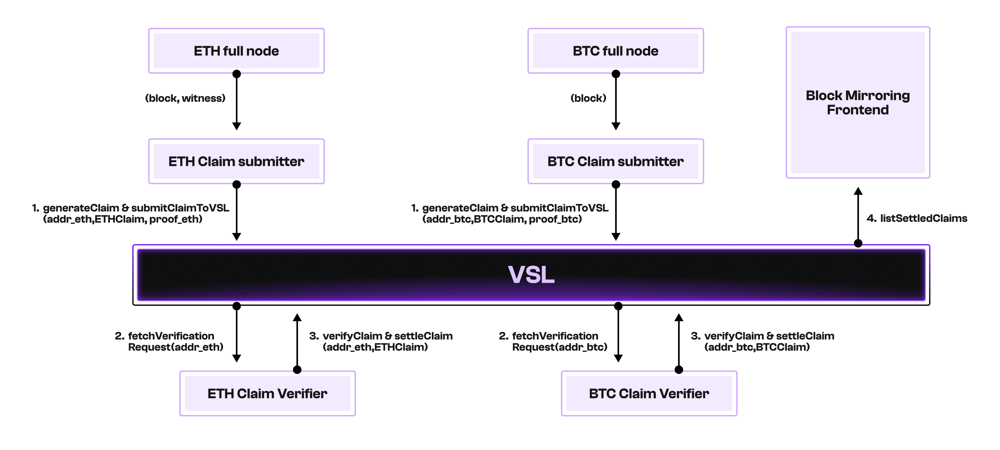

# Blockchain Mirroring Demo

## Overview

This demo demonstrates a comprehensive blockchain mirroring system that enables the verification of block processing across different execution clients. The system mirrors transactions and state from source nodes (Geth and Reth) and generates cryptographic proofs of correct block processing using different execution clients.



The architecture consists of multiple components working together to provide a complete blockchain mirroring solution. Each component can be configured to work with different execution clients, allowing for cross-client verification of block processing.

The system operates through a claim-based verification process. Claim submitters monitor ETH or BTC full nodes and submit claims for each new block. These claims contain block metadata and execution witnesses that enable block re-execution with a stateless client. Verifiers, in turn, monitor the VSL network and provide verification services for submitted claims. When a new claim is detected, verifiers utilize stateless clients to reproduce the blockchain state, re-execute the block, and submit a verification proof to mark the claim as verified on the VSL network.

It includes the following components:

- [frontend](./frontend/README.md): Display the verification records of the following different clients.
- [backend](./backend/README.md): Store the verification records of different verification clients.

- **Bitcoin**
  - [btc-mirroring](./btc-mirroring/): Service that mirrors the Bitcoin chain, generates block processing records, and then verifies the corresponding block verification claims.

- **Ethereum**
  - [mirroring-geth](./mirroring-geth/): Service that mirrors the Geth fullnode, generates block processing records, and then verifies the corresponding block verification claims.
  - [mirroring-reth](./mirroring-reth/): Service that mirrors the Reth fullnode, generates block processing records, and then verifies the corresponding block verification claims.
  - [mirroring-reth-kevm](./mirroring-reth-kevm/): Service that mirrors the Reth fullnode, generates block processing records, and then verifies the corresponding block verification claims.

## Prerequisites

- Geth node: The Geth node must support the `debug_executionWitness` API. Please check [instructions for starting a Geth node with this API](../../generation/block-processing/evm/go/README.md) for how to start a Geth node with this API.
- Reth node: The Reth node must support the `debug_executionWitnessByBlockHash` API. Please check [instructions for starting a Reth node with this API](../../generation/block-processing/evm/rs/README.md) for how to start a Reth node with this API.
- [Docker](https://docs.docker.com/engine/install/)
- [Foundry](https://getfoundry.sh/)

## Quick Start

1. Prepare the environment

   ```sh
   make prepare-env
   ```

2. Update the `GITHUB_ACTOR` and `GITHUB_TOKEN` environment variables in the `./.env` file. They are used to access private repositories during the build phase, please ensure that the token has [read access](https://docs.github.com/en/authentication/keeping-your-account-and-data-secure/managing-your-personal-access-tokens#creating-a-fine-grained-personal-access-token) to the repositories.

3. Use the following command to generate new wallet addresses for the submitter and verifier to use.
   Please generate different submitter and verifier addresses for the following demos.

   ```sh
   make generate-submitter-verifier-keys
   ```

   The following results will be output:

   ```output
    ============= GENERATED ETH KEYS (CAST) =============
    SUBMITTER Keys:
    SUBMITTER_PRIVATE_KEY=0x...
    SUBMITTER_ADDRESS=0x...

    VERIFIER Keys:
    VERIFIER_PRIVATE_KEY=0x...
    VERIFIER_ADDRESS=0x...
    ====================================================
   ```

4. Fill in the environment variables required for [btc-mirroring](./btc-mirroring/).

   - For submitter([./btc-mirroring/claim-submitter/.env](./btc-mirroring/claim-submitter/.env)):

     ```env
      SOURCE_RPC_ENDPOINT=<Bitcoin RPC URL>
      VSL_RPC_URL=<VSL RPC URL>
      SUBMITTER_PRIVATE_KEY=<Submitter Private Key>
      VERIFIER_ADDRESS=<Verifier Address>
     ```

   - For verifier([./btc-mirroring/claim-verifier/.env](./btc-mirroring/claim-verifier/.env)):

     ```env
      VSL_RPC_URL=<VSL RPC URL>
      SUBMITTER_ADDRESS=<Submitter Address>
      VERIFIER_PRIVATE_KEY=<Verifier Private Key>
     ```

5. Fill in the environment variables required for [mirroring-geth](./mirroring-geth/).

   - For submitter([./mirroring-geth/claim-submitter/.env](./mirroring-geth/claim-submitter/.env)):

     ```env
      VSL_RPC=<VSL RPC URL>
      VSL_SUBMITTER_ADDRESS=<Submitter Address>
      VSL_SUBMITTER_PRIVATE_KEY=<Submitter Private Key>
      VSL_VERIFIER_ADDRESS=<Verifier Address>
      VSL_VERIFIER_PRIVATE_KEY=<Verifier Private Key>
      SOURCE_RPC_ENDPOINT=<Geth Fullnode RPC URL>
      SOURCE_WEBSOCKET_ENDPOINT=<Geth Fullnode WS URL>
     ```

   - For verifier([./mirroring-geth/claim-verifier/.env](./mirroring-geth/claim-verifier/.env)):

     ```env
      VSL_RPC=<VSL RPC URL>
      VSL_VERIFIER_ADDRESS=<Verifier Address>
      VSL_VERIFIER_PRIVATE_KEY=<Verifier Private Key>
     ```

6. Fill in the environment variables required for [mirroring-reth](./mirroring-reth/).

   - For submitter([./mirroring-reth/claim-submitter/.env](./mirroring-reth/claim-submitter/.env)):

     ```env
      SOURCE_RPC_ENDPOINT=<Reth Fullnode RPC URL>
      SOURCE_WEBSOCKET_ENDPOINT=<Reth Fullnode WS URL>
      VSL_URL=<VSL RPC URL>
      SUBMITTER_PRIVATE_KEY=<Submitter Private Key>
      VERIFIER_ADDRESS=<Verifier Address>
     ```

   - For verifier([./mirroring-reth/claim-verifier/.env](./mirroring-reth/claim-verifier/.env)):

     ```env
      SOURCE_RPC_ENDPOINT=<Reth Fullnode RPC URL>
      SOURCE_WEBSOCKET_ENDPOINT=<Reth Fullnode WS URL>
      VSL_URL=<VSL RPC URL>
      VERIFIER_PRIVATE_KEY=<Verifier Private Key>
      SUBMITTER_ADDRESS=<Submitter Address>
     ```

7. Fill in the environment variables required for [mirroring-reth-kevm](./mirroring-reth-kevm/).

   - For submitter([./mirroring-reth-kevm/claim-submitter/.env](./mirroring-reth-kevm/claim-submitter/.env)):

     ```env
      SOURCE_RPC_ENDPOINT=<Reth Fullnode RPC URL>
      SOURCE_WEBSOCKET_ENDPOINT=<Reth Fullnode WS URL>
      VSL_URL=<VSL RPC URL>
      SUBMITTER_PRIVATE_KEY=<Submitter Private Key>
      VERIFIER_ADDRESS=<Verifier Address>
     ```

   - For verifier([./mirroring-reth-kevm/claim-verifier/.env](./mirroring-reth-kevm/claim-verifier/.env)):

     ```env
      SOURCE_RPC_ENDPOINT=<Reth Fullnode RPC URL>
      SOURCE_WEBSOCKET_ENDPOINT=<Reth Fullnode WS URL>
      VSL_URL=<VSL RPC URL>
      VERIFIER_PRIVATE_KEY=<Verifier Private Key>
      SUBMITTER_ADDRESS=<Submitter Address>
     ```

8. Before starting all services, please ensure that the above-mentioned addresses have sufficient balances.

9. Fill in the environment variables required for the [./frontend/.env](./frontend/.env).

   ```env
    NEXT_PUBLIC_API_URL=<Backend API URL> # for example: http://<your-ip>:3001
    NEXT_PUBLIC_EXPLORER_URL=<VSL Explorer URL>
   ```

10. Start all services.

    ```sh
     make start
    ```
