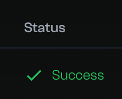

# Wormhole Multichain Demo


## Overview

The VSL-Wormhole integration enables secure cross-chain token transfers by combining VSL's flexible verification framework with Wormhole's NTT (Native Token Transfer) protocol. VSL acts as a custom Transceiver in the NTT architecture, handling message validation and settlement between chains.


### How It Works

1. **Transaction Initiation**
   - User initiates token transfer via NTT Manager contract on source chain
   - Request is forwarded to VSL Transceiver which creates a Transceiver Message
   - Message is sent to VSL core contract

2. **Claim Processing**
   - VSL core contract emits event with claim data
   - Off-chain generator constructs claim and verifiability proof
   - Claim is submitted to VSL network for validation by VSL Validators
   - Once validated, claim is settled via FastSet protocol

3. **Completion**
   - Inclusion proof generated confirming VSL settlement
   - Relayer submits claim and proof to destination chain's VSL Transceiver
   - Destination NTT Manager finalizes transfer after verification

This architecture separates messaging and verification layers while maintaining security, making cross-chain transfers both flexible and trustworthy.


### Prerequisites

- [Docker](https://docs.docker.com/get-docker/)
- [Docker Compose](https://docs.docker.com/compose/install/) Version >= 2.19.0
- [Foundry](https://book.getfoundry.sh/) (version stable v1.0 or higher)

### Preparation

In order to run the wormhole demo, it is first necessary to deploy the corresponding contracts on the two chains. The following takes Ethereum Sepolia chain and Arbitrum Sepolia chain as examples of the source chain and the dest chain respectively.

1. **Ensure that your account has sufficient balance on both chains to deploy smart contracts**. If your account doesn't have balance, you can get free testnet faucet funds, please refer to [faucets](https://www.alchemy.com/faucets).

2. Go to [tenderly](https://dashboard.tenderly.co) create your RPC invocation address corresponding to the network, the Arbitrum Sepolia chain's RPC URL looks like `https://arbitrum-sepolia.gateway.tenderly.co/${key}`, websocket URL looks like `wss://arbitrum-sepolia.gateway.tenderly.co/${key}`.

3. Go to [Etherscan](https://etherscan.io/myapikey) to create API key for Ethereum Sepolia chain, and go to [Arbiscan](https://arbiscan.io/myapikey) to create API key for Arbitrum Sepolia chain.

4. Run a local VSL node or connect to a remote one. For local deployment you can find instructions in the [`VSL-CLI`](https://github.com/Pi-Squared-Inc/vsl-cli) and [`VSL-SDK`](https://github.com/Pi-Squared-Inc/vsl-sdk) repos.

### Initialization

1. Ensure in [examples/wormhole](./) folder, execute the following commands to update dependencies and copy templates with environment variables:

   ```bash
   make install
   make prepare-env
   ```

2. Fill [./.env](./.env) with appropriate values

   ```env
   SRC_CHAIN_ID <= Source chain ID
   SRC_RPC_URL <= Source chain RPC URL
   SRC_ETHERSCAN_API_KEY <= Source chain explorer API key
   SRC_PRIVATE_KEY <= Your account private key, starts With 0x
   DEST_CHAIN_ID <= Destination chain ID
   DEST_RPC_URL <= Destination chain RPC URL
   DEST_ETHERSCAN_API_KEY <= Destination chain explorer API key
   DEST_PRIVATE_KEY <= Your account private key, starts With 0x, can same with SRC_PRIVATE_KEY
   ```

3. Deploy the PeerToken, Vsl, NttManager, and Transceiver contracts on the source chain

   ```bash
   make deploy-source-chain
   ```

   After the execution is successful, you will see an output similar to the following format in the console.

   ```log
   Script ran successfully.

   == Logs ==
   Token address: 0xB506E780805a945e13691560ADf90421A1c6f03b
   VSL address: 0x9a5Ae52Cfb54a589FbF602191358a293C1681173
   NttManager address: 0x1117CDa95eb204047e7C733744Ad0c30914fD88b
   Transceiver address: 0xfb5b0089e71C3f754aB766FeA84afE35Fa0DE9D6
   ```

   Fill these four addresses into the [./.env](./.env)

   ```log
   Source token address => SRC_TOKEN_ADDRESS
   Source VSL contract address => SRC_VSL_ADDRESS
   Source NttManager contract address => SRC_MANAGER_ADDRESS
   Source Transceiver contract address => SRC_TRANSCEIVER_ADDRESS
   ```

4. Deploy the PeerToken, Vsl, NttManager, and Transceiver contracts on the destination chain

   ```bash
   make deploy-dest-chain
   ```

   Same as the previous step. Fill these four addresses into the [./.env](./.env)

   ```log
   Token address => DEST_TOKEN_ADDRESS
   VSL address => DEST_VSL_ADDRESS
   NttManager address => DEST_MANAGER_ADDRESS
   Transceiver address => DEST_TRANSCEIVER_ADDRESS
   ```
   
5. Fill [./relayer/.env](./relayer/.env)

   ```log
   Destination chain private key => DEST_PK
   Destination chain RPC URL => DEST_RPC
   Destination chain VSL address => DEST_VSL_ADDRESS
   ```

   Fill [./observer/.env](./observer/.env)

   ```log
   Source VSL contract address => SOURCE_VSL_CONTRACT_ADDRESS
   Source chain RPC URL => SOURCE_RPC_ENDPOINT
   Source chain websocket URL => SOURCE_WEBSOCKET_ENDPOINT
   VSL node RPC endpoint => VSL_RPC
   VSL observer account address => VSL_CLIENT_ADDRESS
   VSL observer account private key => VSL_CLIENT_PRIVATE_KEY
   VSL verifier account address => VSL_VERIFIER_ADDRESS
   VSL verifier account private key => VSL_VERIFIER_PRIVATE_KEY
   ```

   Fill [./verifier/.env](./verifier/.env)

   ```log
   VSL node RPC endpoint => VSL_RPC
   VSL verifier account address => VSL_VERIFIER_ADDRESS
   VSL verifier account private key => VSL_VERIFIER_PRIVATE_KEY
   ```

   Fill [./relayer/.env](./relayer/.env)

   ```log
   Destination chain private key => DEST_PK
   Destination chain RPC URL => DEST_RPC
   Destination chain VSL contract address => DEST_VSL_ADDRESS
   VSL node RPC endpoint => VSL_RPC
   VSL observer account address => VSL_OBSERVER_ADDRESS
   ```

   Fill [./web/.env](./web/.env) file with new addresses:

   ```log
   Source chain ID => NEXT_PUBLIC_SOURCE_CHAIN_ID
   Destination chain ID => NEXT_PUBLIC_DEST_CHAIN_ID
   Source token contract address => NEXT_PUBLIC_SOURCE_TOKEN_ADDRESS
   Source VSL contract address => NEXT_PUBLIC_SOURCE_VSL_ADDRESS
   Source NttManager contract address => NEXT_PUBLIC_SOURCE_MANAGER_ADDRESS
   Destination token contract address => NEXT_PUBLIC_DEST_TOKEN_ADDRESS
   Destination VSL contract address => NEXT_PUBLIC_DEST_VSL_ADDRESS
   Source chain RPC URL => NEXT_PUBLIC_SOURCE_API
   Source chain websocket URL => NEXT_PUBLIC_SOURCE_WS_URL
   Destination chain RPC URL => NEXT_PUBLIC_DEST_API
   Destination chain websocket URL => NEXT_PUBLIC_DEST_WS_URL
   VSL explorer URL => NEXT_PUBLIC_VSL_EXPLORER_URL
   ```

6. Setup the Token, NttManager and Transceiver contracts on the source chain

   ```bash
   make setup-source-chain
   ```

7. Setup the Token, NttManager and Transceiver contracts on the destination chain

   ```bash
   make setup-dest-chain
   ```

### Deploy

1. Build and Run all the components and Wormhole example

   > **Note:** The relayer image was hosted on Pi Squared's GitHub Container Registry, you will need to login your Docker environment to the GitHub Container Registry first. Please refer to [Authenticating to the Container registry](https://docs.github.com/en/packages/working-with-a-github-packages-registry/working-with-the-container-registry#authenticating-to-the-container-registry) for more details.

   ```bash
   make docker-build
   make docker-up
   ```

2. Open the frontend page and try out transferring tokens in your browser. The default address is `localhost:3000`.

3. Stop all the components and Wormhole example

   ```bash
   make docker-down
   ```

### Usage

1. Open the front-end page deployed by the deployment steps, and you will see the following page.

   

2. Click `Connect Wallet` to connect your wallet.

   

3. Then, you need to click the `Faucet` button on the top bar to mint tokens on the source chain. After that, you can see that you have a balance in Sepolia.

   

4. Enter the amount(must be less than the previously approved amount) to approve for spending to the source chain token contract, and click the `Approve` button and confirm the transaction.

   

5. Click the Transfer button and confirm the transaction. If you encounter `EstimateGasExecutionError`, please appropriately increase the gas fee.

6. After the transfer transaction is completed, switch to the `History` tab to locate the transaction record you just sent. The entire transfer process is complete once the status shows 'Success'.

   

7. Switch back to the Transfer tab and check the balance of destination chain, the transfer tokens will be minted on the destination chain.

## For Developer

If you want to deploy and test the Wormhole demo on the localnet, please refer to this [README.local.md](./README.local.md).
